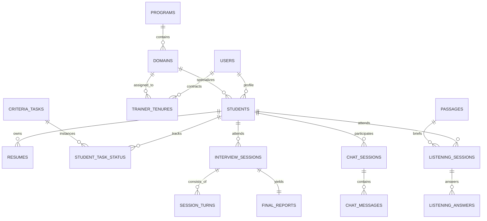
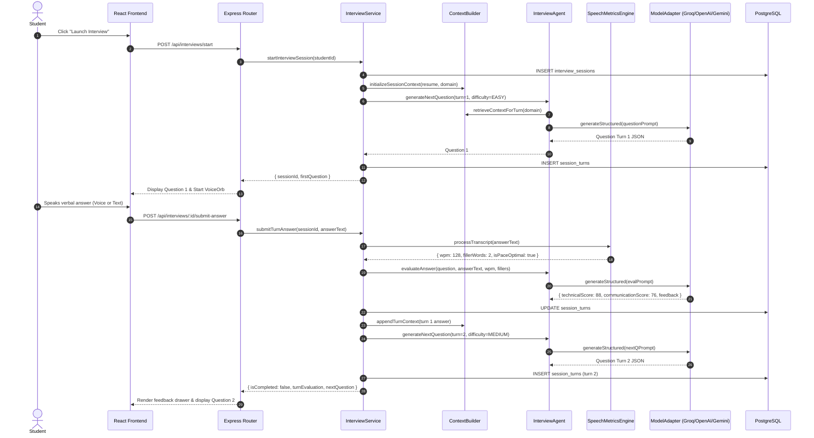
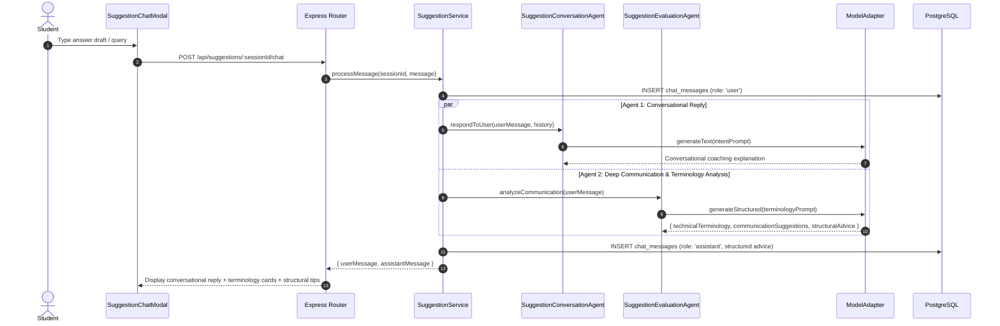

# Master Backend Blueprint & Engineering Specification
# AI-Powered Communication Readiness Platform (College Edition)

> **Deployment Scope:** Single-College Institutional Deployment (2,000–3,000 Engineering Students)  
> **Backend Architecture:** Modular Node.js Monolith + Layered Model Adapter + Autonomous Agent Layer + Ephemeral RAG  
> **Database:** PostgreSQL (Normalized Schemas: `identity`, `college`, `assessment`, `listening`, `suggestions`)  
> **Presentation Layer:** React 19 + TypeScript + Tailwind CSS v4 (Mobbin Minimalist Aesthetic)

---

## Table of Contents
1. [System Architecture](#1-system-architecture)
2. [Frontend / Backend Interaction](#2-frontend--backend-interaction)
3. [Database Architecture & Logical Schemas](#3-database-architecture--logical-schemas)
4. [Authentication Flow](#4-authentication-flow)
5. [Role-Based Access Control (RBAC) & Scopes](#5-role-based-access-control-rbac--scopes)
6. [High-Level Student Journey](#6-high-level-student-journey)
7. [Resume Intake & Parsing Flow](#7-resume-intake--parsing-flow)
8. [Proctored Mock Interview Flow](#8-proctored-mock-interview-flow)
9. [RAG Architecture & Knowledge Grounding](#9-rag-architecture--knowledge-grounding)
10. [Vector Database Lifecycle & Privacy](#10-vector-database-lifecycle--privacy)
11. [Interview Agent](#11-interview-agent)
12. [Evaluation Agent](#12-evaluation-agent)
13. [Listening Comprehension Module](#13-listening-comprehension-module)
14. [Suggestion System (Chatbot)](#14-suggestion-system-chatbot)
15. [Two Suggestion Agents (Conversation + Evaluation)](#15-two-suggestion-agents-conversation--evaluation)
16. [Model Adapter Layer (Replaceable & Provider-Independent)](#16-model-adapter-layer-replaceable--provider-independent)
17. [LLM Provider Switching (Groq, OpenAI, Gemini, Local Mock)](#17-llm-provider-switching-groq-openai-gemini-local-mock)
18. [Faculty Mentor Flow](#18-faculty-mentor-flow)
19. [Program Admin Flow](#19-program-admin-flow)
20. [Visiting Domain Trainer Flow](#20-visiting-domain-trainer-flow)
21. [Placement Coordinator Flow](#21-placement-coordinator-flow)
22. [HOPE Track Architecture](#22-hope-track-architecture)
23. [HOPE Elite Track](#23-hope-elite-track)
24. [HOPE Non-Elite Track](#24-hope-non-elite-track)
25. [PEP Track (Professional Enhancement Program)](#25-pep-track-professional-enhancement-program)
26. [The 21 PEP Technical Domains](#26-the-21-pep-technical-domains)
27. [Students Outside HOPE & PEP (Department Stream)](#27-students-outside-hope--pep-department-stream)
28. [Mentor Assignment Matrix](#28-mentor-assignment-matrix)
29. [Trainer Assignment & Tenure Lifecycle](#29-trainer-assignment--tenure-lifecycle)
30. [Task & Criteria Checklist System (CSV Extensible)](#30-task--criteria-checklist-system-csv-extensible)
31. [Coding Platform Profile Integration](#31-coding-platform-profile-integration)
32. [Diagnostic Scoring Model](#32-diagnostic-scoring-model)
33. [Progress Tracking & Longitudinal Analytics](#33-progress-tracking--longitudinal-analytics)
34. [Platform Security & Data Protection](#34-platform-security--data-protection)
35. [API Architecture & Complete Contract](#35-api-architecture--complete-contract)
36. [Error Handling & Resilience](#36-error-handling--resilience)
37. [Data Lifecycle & Retention Policies](#37-data-lifecycle--retention-policies)
38. [Future Extensibility Roadmap](#38-future-extensibility-roadmap)
39. [Entity-Relationship Diagram (ERD)](#39-entity-relationship-diagram-erd)
40. [Sequence Diagrams for Important AI Flows](#40-sequence-diagrams-for-important-ai-flows)
41. [Role & Permission Matrix](#41-role--permission-matrix)

---

## 1. System Architecture
The backend is designed as a **High-Performance Modular Monolith in Node.js with TypeScript**. All operational domain modules run in-process to avoid distributed transaction overhead, network latency, and microservice failure cascades, while maintaining strict separation of concerns across layers:
- **Presentation Layer**: React 19 Single Page Application communicating over JSON REST HTTP.
- **API Routing & Middleware**: Express router enforcing Bearer JWT authentication, RBAC role validation, rate limiting, and CORS.
- **Application Services**: Isolated business logic services for Auth, Students, Tasks, Interviews, Listening, Suggestions, and Administration.
- **Autonomous Agent Layer**: Dedicated agents for Interviewing, Suggestion Conversations, and Suggestion Communication Evaluation.
- **Model Adapter Layer**: Standardized `IModelAdapter` interface isolating the platform from LLM vendor lock-in.
- **Context & RAG Layer**: Ephemeral session-scoped vector indexing for zero permanent data leakage.
- **System of Record**: PostgreSQL relational database logically partitioned across 5 schemas.

---

## 2. Frontend / Backend Interaction
The existing frontend UI (`frontend/src`) interfaces with the Node.js API (`backend/src`) via `frontend/src/services/api.ts`:
- Token-based Bearer JWT authentication with fallback demo headers for previewing all 5 portals seamlessly.
- Non-intrusive Suggestion Chat modal integrated on the student dashboard.
- Real-time tab switch and proctoring telemetry sent on browser `visibilitychange` events.
- Turn-by-turn verbal transcript submission with instantaneous speech metrics feedback.

---

## 3. Database Architecture & Logical Schemas
PostgreSQL serves as the primary system of record, organized into 5 logical schemas:
1. `identity`: Users, audit logs, authentication credentials, and roles.
2. `college`: Programs (HOPE, PEP, DEPARTMENT), 21 PEP domains, trainer contracts, students, resumes, and criteria tasks.
3. `assessment`: Mock interview assignments, sessions, turns, speech metrics, and final diagnostic scorecards.
4. `listening`: Comprehension passages, sessions, audio replays, and verbal recall evaluations.
5. `suggestions`: Chatbot sessions, user messages, and multi-agent AI terminology & communication advice.

---

## 4. Authentication Flow
- **Registration**: Email and password hashed with `bcryptjs` (salt rounds: 10). Automatic enrollment into student profiles.
- **Login**: Verifies credentials, validates account status (`ACTIVE`), and issues a signed JSON Web Token (JWT) with standard expiration.
- **Session Resolution**: Middleware validates `Authorization: Bearer <token>` and populates `req.user`.

---

## 5. Role-Based Access Control (RBAC) & Scopes
Every endpoint is protected server-side by role and scope authorization:
1. `STUDENT`: Access own profile, upload resume, attend mock interviews, attend listening tests, chat with suggestion coach, checklist placement tasks.
2. `FACULTY_MENTOR`: View assigned ~25 mentees, inspect mentee scores, verify criteria tasks. Cannot view unrelated students.
3. `PROGRAM_ADMIN`: Manage students within assigned track/domain, onboard/revoke visiting trainers, assign domain mock drills.
4. `TRAINER`: View domain students and assign mock drills strictly during active contract tenure dates.
5. `PLACEMENT_COORDINATOR`: Super-admin university-wide oversight, assign mentors, manage all users, assign college-wide mock interviews, export Senate reports.

---

## 6. High-Level Student Journey
1. Create Account & Login.
2. Fill student details & connect external coding profiles (LeetCode, GitHub, HackerRank, Codeforces, CodeChef).
3. Upload PDF Resume (mandatory).
4. View dashboard analytics, cohort benchmarks, and placement syllabus checklist.
5. Launch Proctored AI Mock Interview with resume-grounded questions.
6. Launch Auditory Listening Comprehension Test.
7. Access AI Suggestion Coach for terminology and communication refinement.
8. Receive explainable diagnostic reports with concrete next steps.

---

## 7. Resume Intake & Parsing Flow
- Candidate uploads PDF/DOCX resume via `ResumeUploadModal`.
- Extractor parses skills (languages, frameworks, databases, developer tools) and projects (title, tech stack, scale, descriptions).
- Structured JSON data is saved into `college.resumes.parsed_skills` and `parsed_projects`.
- Provides the grounding knowledge for RAG during AI mock interviews.

---

## 8. Proctored Mock Interview Flow
- Fullscreen enforcement and browser focus monitoring.
- Tab-switch tracking:
  - 1–2 switches: Warning banner.
  - 3–4 switches: Alert logged in audit log.
  - $\ge$ 5 switches: Session marked `is_proctor_flagged = true`.
- Adaptive difficulty progression: starts at `EASY`; high scoring turns elevate candidate to `MEDIUM` and `ADVANCED`.

---

## 9. RAG Architecture & Knowledge Grounding
- Resume projects, technologies, and target track syllabus are chunked into vector documents.
- Before formulating each question, semantic similarity search retrieves relevant candidate project experience.
- Prompts constrain the LLM to question real architecture decisions rather than generic trivia.

---

## 10. Vector Database Lifecycle & Privacy
- **Ephemeral Session Index**: When an interview session starts, a temporary vector collection `session_{id}` is created in memory.
- **Turn Updates**: Candidate answers are appended to maintain context.
- **Session Purge**: When the session concludes, all temporary vectors are destroyed. Permanent results remain strictly in PostgreSQL.

---

## 11. Interview Agent
Autonomous agent managing conversational interview state:
- Grounded question generation tailored to candidate resume.
- Answer evaluation: scores technical correctness (0–100) and communication clarity (0–100).
- Difficulty adjustment engine based on turn performance.
- Final report synthesis with actionable recommendations.

---

## 12. Evaluation Agent
Single-pass evaluation engine assessing:
- Technical accuracy and depth.
- Directness, articulation, and structure.
- Filler word frequency penalty.
- Speaking pace alignment against the optimal 120–150 WPM benchmark.

---

## 13. Listening Comprehension Module
- AI narrates an audio scenario (e.g. *Client System Requirements: Real-Time Payment Settlement Gateway*).
- Candidate cannot read the text; they listen actively.
- Strict 2-replay limiter enforced by backend.
- Spoken verbal answers are evaluated for auditory recall accuracy.

---

## 14. Suggestion System (Chatbot)
Dedicated AI communication coach accessible on the student dashboard:
- Instant answers to student queries.
- Helps students practice phrasing before high-stakes placement interviews.
- Delivers both conversational replies and structured improvement cards.

---

## 15. Two Suggestion Agents (Conversation + Evaluation)
- **Agent 1: Suggestion Conversation Agent**: Manages conversational dialog, intent understanding, and direct technical explanation.
- **Agent 2: Suggestion Evaluation Agent**: Analyzes candidate communication, identifies professional technical terminology, recommends structural improvements, and detects conversational weaknesses.

---

## 16. Model Adapter Layer (Replaceable & Provider-Independent)
- Unified interface `IModelAdapter`.
- Decouples application logic from specific LLM vendors.
- Allows hot-swapping providers in runtime configuration without touching controllers or services.

---

## 17. LLM Provider Switching (Groq, OpenAI, Gemini, Local Mock)
Supported adapters:
- `GroqModelAdapter`: High-speed inference using LLaMA 3.3.
- `OpenAIModelAdapter`: GPT-4o / GPT-4o-mini.
- `GeminiModelAdapter`: Gemini 1.5 Flash / Pro.
- `MockModelAdapter`: Deterministic local generator for zero-config offline execution and CI testing.

---

## 18. Faculty Mentor Flow
- Mentors are assigned ~25 students.
- Mentors inspect mentee interview scores, communication progress, and LeetCode problem solving.
- Mentors verify criteria tasks (sign-off).

---

## 19. Program Admin Flow
- Program Admins oversee HOPE Elite, HOPE Non-Elite, or one of the 21 PEP domains.
- Onboard visiting domain trainers with active start and end dates.
- Assign mandatory cohort mock interview sessions.
- Revoke trainer access upon workshop completion.

---

## 20. Visiting Domain Trainer Flow
- Industry instructors visiting for 10–15 day tenure.
- Access strictly limited to domain students during active contract dates.
- Review domain student communication scorecards.
- Assign specialized architecture drills.

---

## 21. Placement Coordinator Flow
- University-wide readiness intelligence (Dean / Placement Officer).
- Macro dashboards tracking candidate eligibility rates across cohorts.
- Directly assign faculty mentors to students.
- Export university placement data to CSV and generate Senate Reports.

---

## 22. HOPE Track Architecture
Advanced coding cohort (~300 students) focused on high-bar DSA and system design.

---

## 23. HOPE Elite Track
High-caliber group (52–60 students) preparing for Tier-1 product interviews:
- 250+ LeetCode problems required.
- Concurrency, distributed caching, and low-level design mock drills.

---

## 24. HOPE Non-Elite Track
Accelerated foundation track (~240 students) focusing on core algorithms, tree traversals, and dynamic programming.

---

## 25. PEP Track (Professional Enhancement Program)
Industry-aligned technical specialization curriculum (~1,820 students) supported by a 100-day curriculum and 10–15 days of visiting expert workshops.

---

## 26. The 21 PEP Technical Domains
Extensible domain model supporting:
1. Full Stack Development
2. Cloud Computing & DevOps
3. Cybersecurity & Ethical Hacking
4. AI & Machine Learning
5. Data Engineering & Big Data
6. Mobile Application Development
7. Embedded Systems & Firmware
8. Internet of Things (IoT)
9. Blockchain & Web3
10. UI/UX & Product Design
11. VLSI & Hardware Design
12. Robotics & Automation
13. Game Development (Unity/Unreal)
14. Network Engineering & 5G
15. Software Quality Assurance & Automation
16. Site Reliability Engineering (SRE)
17. FinTech & Quantitative Engineering
18. AR/VR & Spatial Computing
19. Natural Language Processing (NLP)
20. Computer Vision & Graphics
21. Enterprise Java Systems

---

## 27. Students Outside HOPE & PEP (Department Stream)
Students not enrolled in HOPE or PEP remain under their academic department:
- Fully supported with student profiles and dashboards.
- Assigned to faculty mentors.
- Track syllabus criteria tasks and attend communication readiness assessments.

---

## 28. Mentor Assignment Matrix
Every candidate (HOPE, PEP, or Department) is assigned to a faculty mentor. Mentors have view-only access to their assigned ~25 candidates and task verification permissions.

---

## 29. Trainer Assignment & Tenure Lifecycle
- Program Admin onboards visiting trainers with `start_date` and `end_date`.
- Middleware verifies active tenure on each request.
- Program Admin can revoke access at any time.

---

## 30. Task & Criteria Checklist System (CSV Extensible)
Placement criteria tasks imported from college placement syllabi. Students checklist items as completed; mentors review evidence and verify sign-off.

---

## 31. Coding Platform Profile Integration
Candidate profiles link external handles and problem statistics:
- LeetCode (problems solved count)
- GitHub (public repositories count)
- HackerRank, Codeforces, CodeChef

---

## 32. Diagnostic Scoring Model
$\text{Overall Score} = (\text{TechnicalAverage} \times 0.70) + (\text{CommunicationAverage} \times 0.30)$
Communication Average integrates:
- Fluency & Articulation (35%)
- Speaking Pace / WPM Alignment (25%)
- Filler Word Penalty (20%)
- Clarity & Delivery (20%)

---

## 33. Progress Tracking & Longitudinal Analytics
Turn-by-turn evaluations compile into immutable final diagnostic reports stored in `assessment.final_reports`, providing progress tracking over successive sessions.

---

## 34. Platform Security & Data Protection
- Bcrypt password hashing.
- Server-side RBAC with domain and mentor scoping.
- Transient audio processing (audio streams processed in RAM and discarded for student privacy).
- Parameterized SQL queries preventing SQL injection.

---

## 35. API Architecture & Complete Contract

| Method | Endpoint | Description | Role / Scope |
|---|---|---|---|
| `POST` | `/api/auth/register` | Register new user | Public |
| `POST` | `/api/auth/login` | Login & receive JWT | Public |
| `GET` | `/api/auth/me` | Get current user identity | Authenticated |
| `GET` | `/api/students/:id` | Get student profile | Student / Mentor / Admin |
| `PUT` | `/api/students/:id/coding-handles` | Update coding handles | Student |
| `POST` | `/api/students/:id/resume` | Upload & parse resume | Student |
| `POST` | `/api/tasks/:studentId/toggle/:taskId` | Toggle task completion | Student |
| `POST` | `/api/tasks/:studentId/verify/:taskId` | Verify criteria task | Faculty Mentor / Coord |
| `POST` | `/api/tasks/import-csv` | Import criteria tasks | Placement Coordinator |
| `POST` | `/api/interviews/start` | Start mock interview | Student |
| `POST` | `/api/interviews/:id/proctor-event` | Record tab switch event | Student |
| `POST` | `/api/interviews/:id/submit-answer` | Submit answer & evaluate | Student |
| `POST` | `/api/interviews/:id/finalize` | Finalize & generate report| Student |
| `GET` | `/api/interviews/:id/report` | Get diagnostic report | Student / Mentor / Admin |
| `POST` | `/api/listening/start` | Start listening session | Student |
| `POST` | `/api/listening/:id/replay` | Record audio replay | Student |
| `POST` | `/api/listening/:id/submit` | Submit comprehension answers| Student |
| `POST` | `/api/suggestions/session/:studentId` | Get/create chat session | Student |
| `GET` | `/api/suggestions/:sessionId/history` | Get chat message history | Student |
| `POST` | `/api/suggestions/:sessionId/chat` | Send message (2 agents) | Student |
| `GET` | `/api/admin/coordinator-stats` | University macro stats | Placement Coordinator |
| `GET` | `/api/admin/students` | Filtered student roster | Coordinator / Admin |
| `GET` | `/api/admin/mentees` | Assigned 25 mentees list | Faculty Mentor |
| `GET` | `/api/admin/trainer-tenures` | Trainer active tenures | Program Admin / Coord |
| `POST` | `/api/admin/onboard-trainer` | Onboard visiting trainer | Program Admin / Coord |
| `PUT` | `/api/admin/revoke-trainer/:id` | Revoke trainer contract | Program Admin / Coord |
| `GET` | `/api/admin/assignments` | List mock assignments | Authenticated |
| `POST` | `/api/admin/assignments` | Assign mock interview | Coord / Admin / Trainer |
| `GET` | `/api/admin/pep-domains` | List 21 PEP domains | Authenticated |

---

## 36. Error Handling & Resilience
Centralized Express error handling catches all uncaught exceptions, formatting standardized JSON `{ "error": "Description" }` without exposing internal database credentials or call stacks.

---

## 37. Data Lifecycle & Retention Policies
- **Transient**: Raw microphone audio buffers and session vector indexes are in-memory only and purged upon session completion.
- **Permanent**: User profiles, resumes, final diagnostic reports, criteria task verifications, and audit logs.

---

## 38. Future Extensibility Roadmap
- Integration with live LeetCode GraphQL APIs for real-time problem-solved verification.
- Video gaze tracking and posture analytics.
- Automated CSV ingestion for academic criteria rubrics.

---

## 39. Entity-Relationship Diagram (ERD)

---

## 40. Sequence Diagrams for Important AI Flows

### 40.1 Proctored AI Mock Interview Flow

### 40.2 Suggestion System (2-Agent Chatbot Flow)

---

## 41. Role & Permission Matrix

| Operation | Student | Faculty Mentor | Program Admin | Domain Trainer | Placement Coordinator |
|---|:---:|:---:|:---:|:---:|:---:|
| View Own Student Dashboard | Yes | - | - | - | - |
| Upload & Parse Resume | Yes | - | - | - | - |
| Attend AI Mock Interview | Yes | - | - | - | - |
| Attend Listening Comprehension | Yes | - | - | - | - |
| Use Suggestion Coach Chatbot | Yes | - | - | - | - |
| Toggle Placement Task Checklist | Yes | - | - | - | - |
| View Assigned 25 Mentees Roster | - | Yes | - | - | Yes (All) |
| Sign-Off / Verify Mentee Task | - | Yes | - | - | - |
| View Domain Students Roster | - | - | Yes (Domain) | Yes (Domain) | Yes (All) |
| Onboard Visiting Domain Trainer | - | - | Yes (Domain) | - | Yes |
| Revoke Trainer Access | - | - | Yes (Domain) | - | Yes |
| Assign Practice Mock Interview | - | - | Yes (Domain) | Yes (Active Tenure) | Yes (College-wide) |
| Access University Macro KPIs | - | - | - | - | Yes |
| Export Candidate CSV | - | - | - | - | Yes |
| Generate Senate Council Report | - | - | - | - | Yes |

*End of Master Backend Blueprint*
