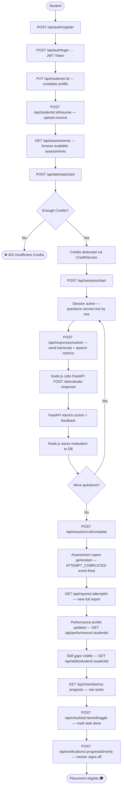
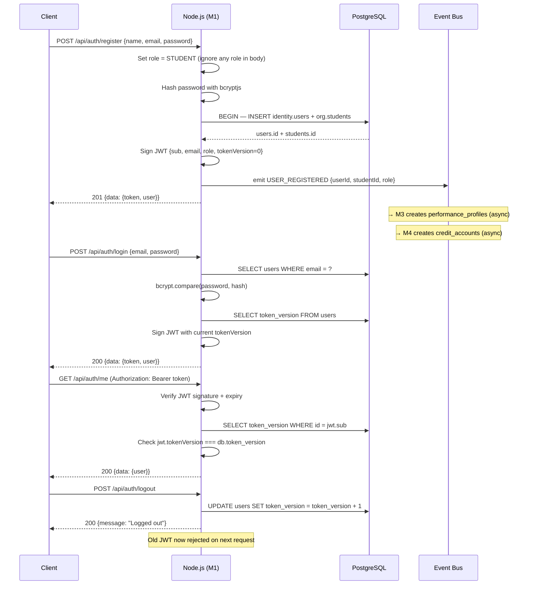
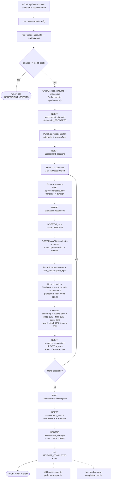
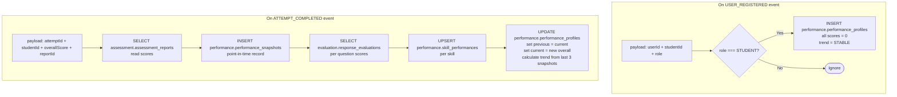

# Communication Readiness Platform — Workflow

> **Audience:** Student developers who want to understand how the system works without reading the full architecture document.
> **Source of truth:** `docs/BACKEND_IMPLEMENTATION_PLAN.md` and `docs/BACKEND_BLUEPRINT.md`

---

## 1. What Are We Building?

A web platform that helps college students prepare for campus placement interviews.

Here is what a student can do:
1. **Register and log in** — create an account, build a profile, upload a resume
2. **Take a mock interview** — answer AI-generated questions, recorded and evaluated in real time
3. **See their score** — communication score, technical score, and an overall report
4. **Track progress** — every assessment updates a running performance profile
5. **Complete a placement checklist** — tasks required before placement eligibility (e.g., mock completed, profile ready)
6. **Get verified by a mentor** — faculty mentors sign off on checklist items

The platform has four roles: `STUDENT`, `FACULTY_MENTOR`, `PROGRAM_ADMIN`, `TRAINER`, and `PLACEMENT_COORDINATOR`.

---

## 2. Complete Student Journey



---

## 3. Four Backend Members

Each team member owns a clear part of the system. Here is what they build and what others can or cannot touch.

---

### Member 1 — Auth, Users, Students, Organization

| | |
|---|---|
| **Builds** | Registration, login, JWT, student profiles, resume upload, mentor/trainer assignments, org hierarchy (departments, programs, batches) |
| **Owns tables** | `identity.users`, `identity.roles`, `org.students`, `org.resumes`, `org.student_mentor_assignments`, `org.trainer_subdivision_assignments`, `org.*` |
| **Others depend on** | `authenticate` middleware, `authorize` middleware, `req.user` type, `eventBus`, shared DB pool, error classes |
| **May read** | Nothing from other members' tables |
| **Must NOT touch** | Assessment tables, performance tables, credit tables, placement tables |

**Delivers first.** All other members need the `src/shared/` infrastructure before they can write a single protected route.

---

### Member 2 — Assessments, Sessions, Responses, AI Evaluation, Reports

| | |
|---|---|
| **Builds** | Assessment CRUD, question bank, attempt lifecycle, session flow, response submission, AI evaluation integration (calling FastAPI), report generation |
| **Owns tables** | `assessment.*`, `session.*`, `evaluation.*` |
| **Others depend on** | Assessment reports (Member 3 reads scores), AI evaluation results (Member 3 uses for skill performance) |
| **May read** | `org.students`, `org.resumes`, `performance.skills`, `performance.listening_stories`, `credit.credit_accounts` |
| **Must NOT touch** | `performance.*`, `credit.*`, `placement.*` — never write to another member's tables |

**Calls FastAPI** for every AI operation. Owns the Node.js HTTP client for the AI service.

---

### Member 3 — Skills, Performance, Listening Stories, Learning, Knowledge, Agents

| | |
|---|---|
| **Builds** | Skills master list, performance profiles, performance snapshots, skill performance aggregation per student, listening story content, learning recommendations (post-MVP), knowledge/RAG (post-MVP), agent system (post-MVP) |
| **Owns tables** | `performance.*`, `knowledge.*`, `agent.*` |
| **Others depend on** | `performance.skills` (Member 2 tags questions), `performance.listening_stories` (Member 2 fetches story for listening session) |
| **May read** | `org.students`, `assessment.assessment_reports`, `evaluation.response_evaluations`, `session.questions`, `session.question_bank_item_skills` |
| **Must NOT touch** | `assessment.*`, `session.*`, `evaluation.*`, `credit.*`, `placement.*` |

**Listens to events.** Member 3 does NOT call other members' services — everything comes through events.

---

### Member 4 — Credits, Checklist, Mentor Verification, Placement

| | |
|---|---|
| **Builds** | Credit accounts, credit ledger, `CreditService.consume()`, checklist items, student progress tracking, mentor verification, placement eligibility (post-MVP) |
| **Owns tables** | `credit.*`, `placement.*` |
| **Others depend on** | `CreditService.consume()` — Member 2 calls this synchronously before creating an attempt |
| **May read** | `org.students`, `org.student_mentor_assignments`, `performance.performance_profiles` (post-MVP) |
| **Must NOT touch** | `assessment.*`, `session.*`, `evaluation.*`, `performance.*` |

**Most critical early deliverable:** `CreditService.consume()` must be ready by Sprint 2 or Member 2 cannot complete the attempt creation flow.

---

## 4. Module Architecture

```
┌──────────────────────────────────────────────────────┐
│  Frontend (React 18 + TypeScript + Vite + Tailwind)  │
│  http://localhost:5173                               │
└───────────────────────┬──────────────────────────────┘
                        │  HTTPS REST + SSE
                        ▼
┌──────────────────────────────────────────────────────┐
│  Node.js 18 + Express 4 + TypeScript                 │
│  http://localhost:5000                               │
│                                                      │
│  ┌─────────────┐  ┌─────────────┐                   │
│  │  Member 1   │  │  Member 2   │                   │
│  │  Auth       │  │  Assess.    │◄──── calls ──────┐│
│  │  Users      │  │  Sessions   │                  ││
│  │  Students   │  │  Responses  │                  ││
│  │  Org        │  │  Reports    │                  ││
│  └─────────────┘  └──────┬──────┘                  ││
│                          │ HTTP                    ││
│  ┌─────────────┐         ▼                         ││
│  │  Member 3   │  ┌─────────────────────────────┐  ││
│  │  Perf.      │  │ FastAPI AI Service           │  ││
│  │  Skills     │  │ http://localhost:8000        │  ││
│  │  Learning   │  │ /ai/evaluate-response        │  ││
│  └─────────────┘  │ /ai/generate-question        │  ││
│                   └──────────────────────────────┘  ││
│  ┌─────────────┐                   │               ││
│  │  Member 4   │                   └──── returns ──┘│
│  │  Credits    │                    AI results       │
│  │  Checklist  │                                     │
│  │  Placement  │                                     │
│  └─────────────┘                                     │
└───────────────────────┬──────────────────────────────┘
                        │  SQL
                        ▼
┌──────────────────────────────────────────────────────┐
│  PostgreSQL                                          │
│  identity · org · assessment · session · evaluation  │
│  performance · credit · placement · system           │
└──────────────────────────────────────────────────────┘
```

**Why FastAPI exists separately:**
Node.js handles all business logic, database writes, and REST APIs. FastAPI handles everything AI-related — calling LLMs, analyzing speech, running agents. Python's AI ecosystem (LangGraph, vector tools) is far better than Node.js for these tasks. Node.js calls FastAPI over HTTP and gets back a structured result, then writes it to PostgreSQL.

---

## 5. Member 1 Workflow



**After USER_REGISTERED fires:**
- Member 3's handler creates a blank `performance_profiles` row for this student
- Member 4's handler creates a `credit_accounts` row with the default credit balance
- These happen asynchronously — the registration HTTP response does not wait for them

---

## 6. Member 2 Workflow



---

## 7. Member 3 Workflow



**Trend rules:**
- `IMPROVING` → current score > last score by more than 2 points
- `DECLINING` → current score < last score by more than 2 points
- `STABLE` → within 2 points

**Member 3 never calls another member's service directly.** Everything arrives through events.

---

## 8. Member 4 Workflow

```mermaid
flowchart TD
    subgraph Register [On USER_REGISTERED event]
        A1[role === STUDENT?]
        A2[INSERT credit.credit_accounts\nbalance = DEFAULT_CREDIT_BALANCE]
        A1 -- Yes --> A2
    end

    subgraph Deduct [Credit deduction — synchronous call from M2]
        B1[AttemptService calls CreditService.consume\nstudentId + amount + reason + referenceId]
        B2[SELECT credit_accounts FOR UPDATE\nrow-level lock]
        B3{balance >= amount?}
        B4[Return 402 to M2]
        B5[UPDATE balance = balance minus amount\nINSERT credit_transactions type=CONSUMPTION]
        B6[COMMIT — return new balance]
        B1 --> B2 --> B3
        B3 -- No --> B4
        B3 -- Yes --> B5 --> B6
    end

    subgraph Earn [On ATTEMPT_COMPLETED event]
        C1[CreditService.earn\nstudentId + CREDIT_COMPLETION_REWARD]
        C2[UPDATE balance = balance + reward\nINSERT credit_transactions type=EARNING]
        C1 --> C2
    end

    subgraph Checklist [Checklist and Verification]
        D1[Student: POST /api/checklist/:itemId/toggle]
        D2[INSERT or UPDATE checklist_progress\nstatus = COMPLETED]
        D3[emit CHECKLIST_ITEM_TOGGLED]
        D4[Mentor: POST /api/verifications/:progressId/verify]
        D5[Verify mentor is assigned to this student\nSELECT student_mentor_assignments]
        D6[INSERT mentor_verifications]
        D7[emit MENTOR_VERIFIED]
        D1 --> D2 --> D3
        D4 --> D5 --> D6 --> D7
    end
```



---

## 9. Event Flow

There are exactly 4 events in the system. Every event has a named publisher and named consumers.

```
┌──────────────────────────────────────────────────────────────────┐
│                         EVENTS                                   │
├──────────────────────┬──────────────────┬────────────────────────┤
│ Event                │ Published by     │ Consumed by            │
├──────────────────────┼──────────────────┼────────────────────────┤
│ USER_REGISTERED      │ Member 1 (auth)  │ Member 3 → create      │
│                      │ after register   │   performance_profiles │
│                      │ transaction      │ Member 4 → create      │
│                      │ commits          │   credit_accounts      │
├──────────────────────┼──────────────────┼────────────────────────┤
│ ATTEMPT_COMPLETED    │ Member 2 (after  │ Member 3 → update      │
│                      │ report inserted) │   performance profile  │
│                      │                  │ Member 4 → earn        │
│                      │                  │   completion credits   │
├──────────────────────┼──────────────────┼────────────────────────┤
│ CHECKLIST_ITEM       │ Member 4 (after  │ Nobody in MVP          │
│ _TOGGLED             │ student toggles) │ (logged only)          │
├──────────────────────┼──────────────────┼────────────────────────┤
│ MENTOR_VERIFIED      │ Member 4 (after  │ Member 4 (self) →      │
│                      │ mentor verifies) │   eligibility recalc   │
└──────────────────────┴──────────────────┴────────────────────────┘
```

**MVP transport:** In-process `EventEmitter` — fire and forget. Events are lost if the process crashes between DB write and emit. Acceptable for MVP single-server deployment.

**Production plan (Beta gate):** Replace with RabbitMQ. Same payload interfaces — only the transport changes.

**Key rule:** Credit deduction (`CreditService.consume`) is NOT an event. It is a synchronous direct function call from Member 2 to Member 4. This is because the credit check must block the HTTP response — if credits are insufficient, the attempt must not be created.

---

## 10. Database Overview

Do not think of these as rows in a spreadsheet. Think of them as buckets of related data.

| Schema | Key Tables | Purpose |
|---|---|---|
| `identity` | `users`, `roles`, `role_assignments` | Who you are and what you're allowed to do |
| `org` | `students`, `resumes`, `student_mentor_assignments`, `institutions`, `programs`, `batches` | The college structure — who is in which program, batch, with which mentor |
| `assessment` | `assessments`, `assessment_attempts`, `assessment_reports` | The catalog of assessments and each student's attempt history + final report |
| `session` | `assessment_sessions`, `questions`, `question_bank_items` | The actual running interview or listening session and the questions asked |
| `evaluation` | `responses`, `response_evaluations`, `ai_runs` | What the student said and what the AI scored |
| `performance` | `performance_profiles`, `performance_snapshots`, `skills`, `skill_performances` | A student's running score history and which skills they are strong or weak in |
| `credit` | `credit_accounts`, `credit_transactions` | The credit balance and every deduction/earning transaction |
| `placement` | `checklist_items`, `checklist_progress`, `mentor_verifications` | The placement readiness checklist and which items are verified |
| `system` | `audit_logs`, `outbox_events` | Every important action recorded for audit; outbox for future event reliability |

---

## 11. MVP Workflow

### MUST HAVE (working by Alpha — Day 17)

```
Register student → Login → Student profile → Resume upload
    ↓
Start assessment attempt (credit check → deduct)
    ↓
Interview session → Questions → Submit responses → AI evaluation
    ↓
Complete session → Assessment report
    ↓
Performance profile updated → Skills breakdown
    ↓
Credit earned on completion
    ↓
Checklist items → Student progress → Mentor verification
```

### SHOULD HAVE LATER (Beta — Day 24)

- Placement eligibility calculation
- RAG-grounded AI questions (knowledge base)
- LangGraph adaptive interview agent
- RabbitMQ replacing EventEmitter
- MinIO replacing local disk for resumes
- Learning plans and recommendations

### ADVANCED / FUTURE

- Multi-institution support
- Video/gaze analysis
- Token refresh
- External coding profile integration (LeetCode, GitHub)
- Full outbox pattern with retry
- Kubernetes production deployment

---

## 12. Development Order

```
Phase 1 — Foundation (Sprint 1, Days 4–9)
────────────────────────────────────────────────────────
M1: Create src/shared/ — pool, errors, eventBus, middleware, types
    Write migrations 001–006 (identity + org schemas)
    Commit shared/ to main FIRST — others depend on it

M2: Design session state machine (paper)
    Write migrations 031–039 (assessment/session/evaluation schemas)
    Create module folder scaffolds

M3: Design performance aggregation logic (paper)
    Write migrations 061–066 (performance/knowledge/agent schemas)
    Create module folder scaffolds

M4: Design credit ledger rules (paper)
    Write migrations 091–093 (credit/placement schemas)
    Deliver CreditService stub for M2

GATE: DB migrates cleanly. All tables exist. CI runs.


Phase 2 — Auth + Core (Sprint 2, Days 9–17)
────────────────────────────────────────────────────────
M1: Register, login, logout, JWT revocation
    Student profile endpoints
    Emit USER_REGISTERED

M2: Assessment CRUD, question bank
    Question skill tagging (reads M3's skills)

M3: Skills seed + CRUD
    Listening stories seed + CRUD
    USER_REGISTERED handler → create performance_profiles

M4: CreditService.consume() ← HIGHEST PRIORITY
    USER_REGISTERED handler → create credit_accounts

GATE: Auth works. CreditService ready for M2 to import.


Phase 3 — Assessment Pipeline (Sprint 3, Days 17–24)
────────────────────────────────────────────────────────
M1: Resume upload, mentor assignments, trainer tenure

M2: Wire CreditService.consume() into AttemptService
    Start attempt, start session, proctoring
    Submit response → call FastAPI → save evaluation
    Complete session → generate report
    Emit ATTEMPT_COMPLETED

M3: ATTEMPT_COMPLETED handler → update performance profile
    Snapshot creation, skill performance aggregation

M4: ATTEMPT_COMPLETED handler → earn credits
    Checklist progress, mentor verification

GATE: Full student journey works end-to-end.


Phase 4 — Integration + Hardening (Sprint 4, Days 24–29)
────────────────────────────────────────────────────────
M1: Org endpoints, admin portals, security audit
M2: Listening session flow, suggestion system (post-MVP)
M3: Knowledge/RAG, LangGraph agent (post-MVP)
M4: Placement eligibility, credit policies (post-MVP)
All: RabbitMQ migration, MinIO, Playwright tests, CI security scans

GATE: Platform fully functional. Security scans clean. K8s manifests defined.
```

---

## 13. One-Page Quick Overview

```
WHAT: College placement interview preparation platform
      Students take AI-evaluated mock interviews and track their performance

WHO:  4 backend developers — each owns a clear domain
      1 frontend team using React + TypeScript

HOW (Tech Stack):
  Browser          React 18 + TypeScript + Vite + Tailwind
  API              Node.js 18 + Express 4 + TypeScript
  AI Service       Python 3.11 + FastAPI (separate process)
  Database         PostgreSQL (all schemas in one DB)
  Cache/Rate limit Redis
  File storage     Local disk (MVP) → MinIO (Beta)
  Events           EventEmitter (MVP) → RabbitMQ (Beta)
  LLM              Groq API (already integrated)

THE 4 DOMAINS:
  M1 — Auth + Users + Students + Org
  M2 — Assessments + Sessions + AI evaluation
  M3 — Performance + Skills + Learning
  M4 — Credits + Checklist + Placement

THE 4 EVENTS:
  USER_REGISTERED      → M3 creates profile, M4 creates credit account
  ATTEMPT_COMPLETED    → M3 updates performance, M4 earns credits
  CHECKLIST_TOGGLED    → log only (MVP)
  MENTOR_VERIFIED      → M4 recalculates eligibility

THE CRITICAL DEPENDENCY CHAIN:
  M1 shared/ must be on main FIRST
  ↓
  M4 delivers CreditService.consume() in Sprint 2
  ↓
  M2 wires attempt creation in Sprint 3
  ↓
  M3 + M4 handle ATTEMPT_COMPLETED events

IMPORTANT RULES:
  ✓ Node.js owns all PostgreSQL writes
  ✓ FastAPI returns results, Node.js persists them
  ✓ Only SELECT across module schema boundaries (never INSERT/UPDATE)
  ✓ CreditService.consume() is a direct sync call (not an event)
  ✓ token_version checked on every authenticated request
  ✓ Public register always creates STUDENT (role field ignored)
  ✓ SUPER_ADMIN is banned — use PLACEMENT_COORDINATOR
  ✓ /api/tasks is now /api/checklist
  ✓ /api/interviews is now /api/sessions

SCORING FORMULA:
  fillerScore  = max(0, 100 - filler_count × 5)
  paceScore    = 100 if 120–150 WPM, lower for deviation
  commAvg      = fluency×35% + pace×25% + filler×20% + clarity×20%
  overall      = tech×70% + comm×30%

MIGRATION NUMBER RANGES:
  M1: 001–030  |  M2: 031–060  |  M3: 061–090
  M4: 091–109  |  Shared FKs: 110–119  |  Seeds: 120–130
```

---

*Derived from `docs/BACKEND_IMPLEMENTATION_PLAN.md`. Do not modify architecture here — update the plan document instead.*
